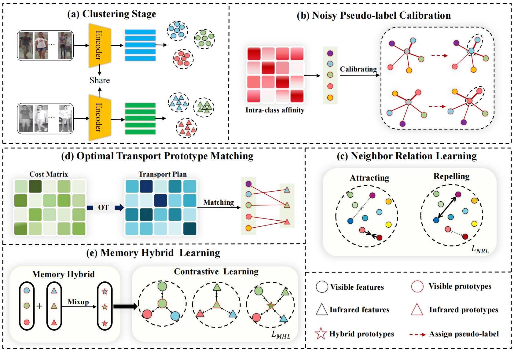

<p align="center">
  <h1 align="center">Robust Pseudo-label Learning with Neighbor Relation for Unsupervised Visible-Infrared Person Re-Identification</h1>
  <p align="center">
    <a href="https://scholar.google.com/citations?hl=zh-CN&pli=1&user=H1rqfM4AAAAJ" rel="external nofollow noopener" target="_blank"><strong>Xiangbo Yin*</strong></a>
    ·
    <a href="https://scholar.google.com/citations?user=Go9q2jsAAAAJ&hl=zh-CN&oi=sra" rel="external nofollow noopener" target="_blank"><strong>Jiangming Shi*</strong></a>
    ·
    <a href="https://scholar.google.com/citations?user=a-I8c8EAAAAJ&hl=zh-CN&oi=sra" target="_blank"><strong>Yachao Zhang</strong></a>
    ·
    <a href="https://scholar.google.com/citations?hl=zh-CN&user=r7r4FGwAAAAJ&view_op=list_works&sortby=pubdate" target="_blank"><strong>Yang Lu</strong></a>
    ·
    <a href="https://scholar.google.com/citations?user=CXZciFAAAAAJ&hl=zh-CN&oi=sra" rel="external nofollow noopener" target="_blank"><strong>Zhizhong Zhang</strong></a>
    ·
    <a href="https://scholar.google.com/citations?user=RN1QMPgAAAAJ&hl=zh-CN&oi=sra" rel="external nofollow noopener" target="_blank"><strong>Yuan Xie† </strong></a>    
    ·
    <a href="https://scholar.google.com/citations?user=idiP90sAAAAJ&hl=zh-CN&oi=sra" rel="external nofollow noopener" target="_blank"><strong>Yanyun Qu† </strong></a>       
  </p>
<p align="center">
  <a href="https://arxiv.org/pdf/2405.05613" rel="external nofollow noopener" target="_blank">Paper Link</a>


This is an official code implementation of "Robust Pseudo-label Learning with Neighbor Relation for Unsupervised Visible-Infrared Person Re-Identification", Which is accepted by ACMMM 2024.


## Requirements
- python 3.8.13
- torch 1.8.0
- torchvision 0.9.0
- scikit-learn 1.2.2
- POT 0.9.3


## Dataset Preprocessing
```shell
python prepare_sysu.py   # for SYSU-MM01
python prepare_regdb.py  # for RegDB
```
You need to change the dataset path to your own path in the `prepare_sysu.py` and `prepare_regdb.py`.


## Training
```shell
sh run_train_sysu.sh     # for SYSU-MM01
sh run_train_regdb.sh    # for RegDB
```
You need to download the [baseline](https://drive.google.com/drive/folders/1KIuklUtwqSvEZgWg5u3iEsh0IuEZj5li) for SYSU-MM01 dataset and put it in `baseline/sysu_s1/`.
## Testing
```shell
sh test_sysu.sh          # for SYSU-MM01
sh test_regdb.sh         # for RegDB
```
<!--## Performance
The following results are based on the collated code and do not differ much from the results in the original paper. The trained models can be downloaded [here](https://drive.google.com/drive/folders/1xJW5LCacF_WKNZmcctTR5XNfLr4rZ91c). 

### Performance on SYSU-MM01 (Batchsize = 128)
<table class="tg">
<thead>
  <tr>
    <th class="tg-gaoc" rowspan="2">Trial</th>
    <th class="tg-gaoc" colspan="6">All Search</th>
    <th class="tg-gaoc" colspan="6">Indoor Search</th>
  </tr>
  <tr>
    <th class="tg-gaoc">Rank-1</th>
    <th class="tg-gaoc">Rank-5</th>
    <th class="tg-gaoc">Rank-10</th>
    <th class="tg-gaoc">Rank-20</th>
    <th class="tg-gaoc">mAP</th>
    <th class="tg-gaoc">mINP</th>
    <th class="tg-gaoc">Rank-1</th>
    <th class="tg-gaoc">Rank-5</th>
    <th class="tg-gaoc">Rank-10</th>
    <th class="tg-gaoc">Rank-20</th>
    <th class="tg-gaoc">mAP</th>
    <th class="tg-gaoc">mINP</th>
  </tr>  
</thead>

<tbody>
  <tr>
    <td class="tg-gaoc">0</td>
    <td class="tg-3ttq">66.21</td>
    <td class="tg-gaoc">85.46</td>
    <td class="tg-gaoc">91.14</td>
    <td class="tg-gaoc">95.74</td>
    <td class="tg-gaoc">60.23</td>
    <td class="tg-gaoc">44.15</td>
    <td class="tg-3ttq">70.15</td>
    <td class="tg-gaoc">90.53</td>
    <td class="tg-gaoc">94.70</td>
    <td class="tg-gaoc">97.28</td>
    <td class="tg-gaoc">74.19</td>
    <td class="tg-gaoc">69.80</td>
  </tr>
  <tr>
    <td class="tg-s4h7">1</td>
    <td class="tg-0udb">63.27</td>
    <td class="tg-s4h7">87.30</td>
    <td class="tg-s4h7">93.16</td>
    <td class="tg-s4h7">96.79</td>
    <td class="tg-s4h7">60.24</td>
    <td class="tg-s4h7">44.79</td>
    <td class="tg-0udb">66.53</td>
    <td class="tg-s4h7">87.55</td>
    <td class="tg-s4h7">93.30</td>
    <td class="tg-s4h7">97.78</td>
    <td class="tg-s4h7">70.76</td>
    <td class="tg-s4h7">65.94</td>
  </tr>
  <tr>
    <td class="tg-s4h7">2</td>
    <td class="tg-0udb">64.87</td>
    <td class="tg-s4h7">88.56</td>
    <td class="tg-s4h7">93.77</td>
    <td class="tg-s4h7">96.77</td>
    <td class="tg-s4h7">58.21</td>
    <td class="tg-s4h7">41.54</td>
    <td class="tg-0udb">67.21</td>
    <td class="tg-s4h7">87.86</td>
    <td class="tg-s4h7">94.29</td>
    <td class="tg-s4h7">97.92</td>
    <td class="tg-s4h7">71.40</td>
    <td class="tg-s4h7">66.67</td>
  </tr>
  <tr>
    <td class="tg-s4h7">3</td>
    <td class="tg-0udb">67.24</td>
    <td class="tg-s4h7">88.80</td>
    <td class="tg-s4h7">95.21</td>
    <td class="tg-s4h7">98.37</td>
    <td class="tg-s4h7">61.76</td>
    <td class="tg-s4h7">46.15</td>
    <td class="tg-0udb">70.56</td>
    <td class="tg-s4h7">92.21</td>
    <td class="tg-s4h7">96.38</td>
    <td class="tg-s4h7">98.41</td>
    <td class="tg-s4h7">74.23</td>
    <td class="tg-s4h7">69.00</td>
  </tr>
  <tr>
    <td class="tg-s4h7">4</td>
    <td class="tg-hi9g">66.39</td>
    <td class="tg-4jb6">87.69</td>
    <td class="tg-4jb6">93.90</td>
    <td class="tg-4jb6">97.63</td>
    <td class="tg-4jb6">62.24</td>
    <td class="tg-4jb6">47.30</td>
    <td class="tg-hi9g">70.83</td>
    <td class="tg-4jb6">89.72</td>
    <td class="tg-4jb6">93.34</td>
    <td class="tg-4jb6">95.83</td>
    <td class="tg-4jb6">74.81</td>
    <td class="tg-4jb6">70.67</td>
  </tr>
  <tr>
    <td class="tg-s4h7">5</td>
    <td class="tg-0udb">66.42</td>
    <td class="tg-s4h7">87.01</td>
    <td class="tg-s4h7">92.72</td>
    <td class="tg-s4h7">97.48</td>
    <td class="tg-s4h7">60.16</td>
    <td class="tg-s4h7">43.80</td>
    <td class="tg-0udb">66.89</td>
    <td class="tg-s4h7">87.95</td>
    <td class="tg-s4h7">95.06</td>
    <td class="tg-s4h7">98.32</td>
    <td class="tg-s4h7">71.85</td>
    <td class="tg-s4h7">68.02</td>
  </tr>
  <tr>
    <td class="tg-s4h7">6</td>
    <td class="tg-0udb">65.58</td>
    <td class="tg-s4h7">87.38</td>
    <td class="tg-s4h7">93.08</td>
    <td class="tg-s4h7">97.37</td>
    <td class="tg-s4h7">58.95</td>
    <td class="tg-s4h7">42.38</td>
    <td class="tg-0udb">68.93</td>
    <td class="tg-s4h7">90.58</td>
    <td class="tg-s4h7">95.24</td>
    <td class="tg-s4h7">98.37</td>
    <td class="tg-s4h7">74.25</td>
    <td class="tg-s4h7">70.84</td>
  </tr>
  <tr>
    <td class="tg-s4h7">7</td>
    <td class="tg-0udb">64.82</td>
    <td class="tg-s4h7">87.33</td>
    <td class="tg-s4h7">93.22</td>
    <td class="tg-s4h7">97.05</td>
    <td class="tg-s4h7">58.78</td>
    <td class="tg-s4h7">42.36</td>
    <td class="tg-0udb">68.61</td>
    <td class="tg-s4h7">89.63</td>
    <td class="tg-s4h7">94.88</td>
    <td class="tg-s4h7">98.51</td>
    <td class="tg-s4h7">73.17</td>
    <td class="tg-s4h7">68.65</td>
  </tr>
  <tr>
    <td class="tg-s4h7">8</td>
    <td class="tg-0udb">64.90</td>
    <td class="tg-s4h7">86.93</td>
    <td class="tg-s4h7">93.53</td>
    <td class="tg-s4h7">97.13</td>
    <td class="tg-s4h7">59.24</td>
    <td class="tg-s4h7">43.48</td>
    <td class="tg-0udb">66.62</td>
    <td class="tg-s4h7">89.63</td>
    <td class="tg-s4h7">95.02</td>
    <td class="tg-s4h7">98.19</td>
    <td class="tg-s4h7">71.47</td>
    <td class="tg-s4h7">66.63</td>
  </tr>
  <tr>
    <td class="tg-s4h7">9</td>
    <td class="tg-0udb">65.21</td>
    <td class="tg-s4h7">88.35</td>
    <td class="tg-s4h7">93.14</td>
    <td class="tg-s4h7">97.11</td>
    <td class="tg-s4h7">59.89</td>
    <td class="tg-s4h7">44.24</td>
    <td class="tg-0udb">68.21</td>
    <td class="tg-s4h7">91.03</td>
    <td class="tg-s4h7">95.29</td>
    <td class="tg-s4h7">98.32</td>
    <td class="tg-s4h7">73.94</td>
    <td class="tg-s4h7">69.93</td>
  </tr>
  <tr>
    <th class="tg-s4h7">Average</th>
    <th class="tg-0udb">65.49</th>
    <th class="tg-s4h7">87.48</th>
    <th class="tg-s4h7">93.29</th>
    <th class="tg-s4h7">97.14</th>
    <th class="tg-s4h7">59.97</th>
    <th class="tg-s4h7">44.02</th>
    <th class="tg-0udb">68.46</th>
    <th class="tg-s4h7">89.67</th>
    <th class="tg-s4h7">94.75</th>
    <th class="tg-s4h7">97.89</th>
    <th class="tg-s4h7">73.01</th>
    <th class="tg-s4h7">68.61</th>
  </tr>
</tbody>
</table>

### Performance on RegDB (Batchsize = 128)
<table class="tg">
<thead>
  <tr>
    <th class="tg-gaoc" rowspan="2">Trial</th>
    <th class="tg-gaoc" colspan="6">Visible to Infrared</th>
    <th class="tg-gaoc" colspan="6">Infrared to Visible</th>
  </tr>
  <tr>
    <th class="tg-gaoc">Rank-1</th>
    <th class="tg-gaoc">Rank-5</th>
    <th class="tg-gaoc">Rank-10</th>
    <th class="tg-gaoc">Rank-20</th>
    <th class="tg-gaoc">mAP</th>
    <th class="tg-gaoc">mINP</th>
    <th class="tg-gaoc">Rank-1</th>
    <th class="tg-gaoc">Rank-5</th>
    <th class="tg-gaoc">Rank-10</th>
    <th class="tg-gaoc">Rank-20</th>
    <th class="tg-gaoc">mAP</th>
    <th class="tg-gaoc">mINP</th>
  </tr>
</thead>
<tbody>
  <tr>
    <td class="tg-gaoc">1</td>
    <td class="tg-3ttq">92.91</td>
    <td class="tg-gaoc">96.89</td>
    <td class="tg-gaoc">98.25</td>
    <td class="tg-gaoc">99.17</td>
    <td class="tg-gaoc">86.28</td>
    <td class="tg-gaoc">73.99</td>
    <td class="tg-3ttq">91.26</td>
    <td class="tg-gaoc">96.41</td>
    <td class="tg-gaoc">98.35</td>
    <td class="tg-gaoc">99.56</td>
    <td class="tg-gaoc">84.82</td>
    <td class="tg-gaoc">70.47</td>
  </tr>
  <tr>
    <td class="tg-s4h7">2</td>
    <td class="tg-0udb">91.80</td>
    <td class="tg-s4h7">96.41</td>
    <td class="tg-s4h7">98.20</td>
    <td class="tg-s4h7">99.17</td>
    <td class="tg-s4h7">83.97</td>
    <td class="tg-s4h7">69.48</td>
    <td class="tg-0udb">90.78</td>
    <td class="tg-s4h7">96.17</td>
    <td class="tg-s4h7">97.72</td>
    <td class="tg-s4h7">98.79</td>
    <td class="tg-s4h7">83.76</td>
    <td class="tg-s4h7">66.89</td>
  </tr>
  <tr>
    <td class="tg-s4h7">3</td>
    <td class="tg-0udb">88.69</td>
    <td class="tg-s4h7">93.01</td>
    <td class="tg-s4h7">94.71</td>
    <td class="tg-s4h7">96.55</td>
    <td class="tg-s4h7">82.65</td>
    <td class="tg-s4h7">70.18</td>
    <td class="tg-0udb">87.28</td>
    <td class="tg-s4h7">92.43</td>
    <td class="tg-s4h7">95.05</td>
    <td class="tg-s4h7">96.75</td>
    <td class="tg-s4h7">81.60</td>
    <td class="tg-s4h7">67.22</td>
  </tr>
  <tr>
    <td class="tg-s4h7">4</td>
    <td class="tg-0udb">88.40</td>
    <td class="tg-s4h7">93.11</td>
    <td class="tg-s4h7">95.05</td>
    <td class="tg-s4h7">96.99</td>
    <td class="tg-s4h7">80.89</td>
    <td class="tg-s4h7">67.35</td>
    <td class="tg-0udb">87.48</td>
    <td class="tg-s4h7">92.96</td>
    <td class="tg-s4h7">95.00</td>
    <td class="tg-s4h7">97.23</td>
    <td class="tg-s4h7">79.66</td>
    <td class="tg-s4h7">64.76</td>
  </tr>
  <tr>
    <td class="tg-s4h7">5</td>
    <td class="tg-hi9g">89.61</td>
    <td class="tg-4jb6">93.98</td>
    <td class="tg-4jb6">96.02</td>
    <td class="tg-4jb6">97.67</td>
    <td class="tg-4jb6">81.32</td>
    <td class="tg-4jb6">66.14</td>
    <td class="tg-hi9g">88.83</td>
    <td class="tg-4jb6">93.69</td>
    <td class="tg-4jb6">95.78</td>
    <td class="tg-4jb6">97.38</td>
    <td class="tg-4jb6">80.12</td>
    <td class="tg-4jb6">62.95</td>
  </tr>
  <tr>
    <td class="tg-s4h7">6</td>
    <td class="tg-0udb">88.40</td>
    <td class="tg-s4h7">94.47</td>
    <td class="tg-s4h7">96.12</td>
    <td class="tg-s4h7">97.77</td>
    <td class="tg-s4h7">82.31</td>
    <td class="tg-s4h7">69.43</td>
    <td class="tg-0udb">87.48</td>
    <td class="tg-s4h7">93.69</td>
    <td class="tg-s4h7">95.63</td>
    <td class="tg-s4h7">97.09</td>
    <td class="tg-s4h7">81.22</td>
    <td class="tg-s4h7">65.68</td>
  </tr>
  <tr>
    <td class="tg-s4h7">7</td>
    <td class="tg-0udb">89.90</td>
    <td class="tg-s4h7">94.17</td>
    <td class="tg-s4h7">95.87</td>
    <td class="tg-s4h7">97.62</td>
    <td class="tg-s4h7">82.72</td>
    <td class="tg-s4h7">69.34</td>
    <td class="tg-0udb">87.57</td>
    <td class="tg-s4h7">93.98</td>
    <td class="tg-s4h7">95.78</td>
    <td class="tg-s4h7">96.94</td>
    <td class="tg-s4h7">81.08</td>
    <td class="tg-s4h7">65.05</td>
  </tr>
  <tr>
    <td class="tg-s4h7">8</td>
    <td class="tg-0udb">88.98</td>
    <td class="tg-s4h7">93.25</td>
    <td class="tg-s4h7">95.44</td>
    <td class="tg-s4h7">97.48</td>
    <td class="tg-s4h7">83.30</td>
    <td class="tg-s4h7">70.59</td>
    <td class="tg-0udb">88.54</td>
    <td class="tg-s4h7">93.69</td>
    <td class="tg-s4h7">95.19</td>
    <td class="tg-s4h7">97.09</td>
    <td class="tg-s4h7">82.01</td>
    <td class="tg-s4h7">66.05</td>
  </tr>
  <tr>
    <td class="tg-s4h7">9</td>
    <td class="tg-0udb">90.97</td>
    <td class="tg-s4h7">95.15</td>
    <td class="tg-s4h7">97.14</td>
    <td class="tg-s4h7">98.35</td>
    <td class="tg-s4h7">83.82</td>
    <td class="tg-s4h7">70.16</td>
    <td class="tg-0udb">89.90</td>
    <td class="tg-s4h7">94.61</td>
    <td class="tg-s4h7">96.46</td>
    <td class="tg-s4h7">97.67</td>
    <td class="tg-s4h7">83.04</td>
    <td class="tg-s4h7">66.14</td>
  </tr>
  <tr>
    <td class="tg-s4h7">10</td>
    <td class="tg-0udb">93.45</td>
    <td class="tg-s4h7">96.12</td>
    <td class="tg-s4h7">97.14</td>
    <td class="tg-s4h7">98.06</td>
    <td class="tg-s4h7">86.22</td>
    <td class="tg-s4h7">72.89</td>
    <td class="tg-0udb">91.80</td>
    <td class="tg-s4h7">96.12</td>
    <td class="tg-s4h7">97.14</td>
    <td class="tg-s4h7">97.96</td>
    <td class="tg-s4h7">85.30</td>
    <td class="tg-s4h7">69.76</td>
  </tr>
  <tr>
    <th class="tg-s4h7">Average</th>
    <th class="tg-0udb">90.31</th>
    <th class="tg-s4h7">94.66</th>
    <th class="tg-s4h7">96.39</th>
    <th class="tg-s4h7">97.88</th>
    <th class="tg-s4h7">83.35</th>
    <th class="tg-s4h7">69.96</th>
    <th class="tg-0udb">89.09</th>
    <th class="tg-s4h7">94.37</th>
    <th class="tg-s4h7">96.21</th>
    <th class="tg-s4h7">97.65</th>
    <th class="tg-s4h7">82.26</th>
    <th class="tg-s4h7">66.50</th>
  </tr>
</tbody>
</table>
-->
## Citation
If our work is helpful for your research, please consider citing:
```
@article{yin2024robust,
  title={Robust Pseudo-label Learning with Neighbor Relation for Unsupervised Visible-Infrared Person Re-Identification},
  author={Yin, Xiangbo and Shi, Jiangming and Zhang, Yachao and Lu, Yang and Zhang, Zhizhong and Xie, Yuan and Qu, Yanyun},
  journal={arXiv preprint arXiv:2405.05613},
  year={2024}
}

@article{shi2024multi,
  title={Multi-Memory Matching for Unsupervised Visible-Infrared Person Re-Identification},
  author={Shi, Jiangming and Yin, Xiangbo and Chen, Yeyun and Zhang, Yachao and Zhang, Zhizhong and Xie, Yuan and Qu, Yanyun},
  journal={arXiv preprint arXiv:2401.06825},
  year={2024}
}

@inproceedings{shi2023dpis,
  title={Dual pseudo-labels interactive self-training for semi-supervised visible-infrared person re-identification},
  author={Shi, Jiangming and Zhang, Yachao and Yin, Xiangbo and Xie, Yuan and Zhang, Zhizhong and Fan, Jianping and Shi, Zhongchao and Qu, Yanyun},
  booktitle={Proceedings of the IEEE/CVF International Conference on Computer Vision},
  pages={11218--11228},
  year={2023}
```

## Contact
xiangboyin@stu.xmu.edu.cn; jiangming.shi@outlook.com.

## Acknowledgements
This work is developed based on works of [ADCA(ACMMM2022)](https://github.com/yangbincv/ADCA), [PGM(CVPR2023)](https://github.com/zesenwu23/USL-VI-ReID), [OTLA(ECCV2022)](https://github.com/wjm-wjm/OTLA-ReID). We sincerely thank all developers for their high-quality works.
